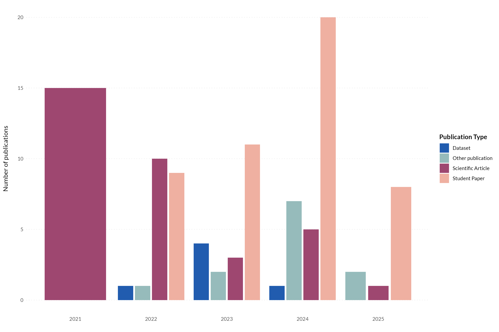
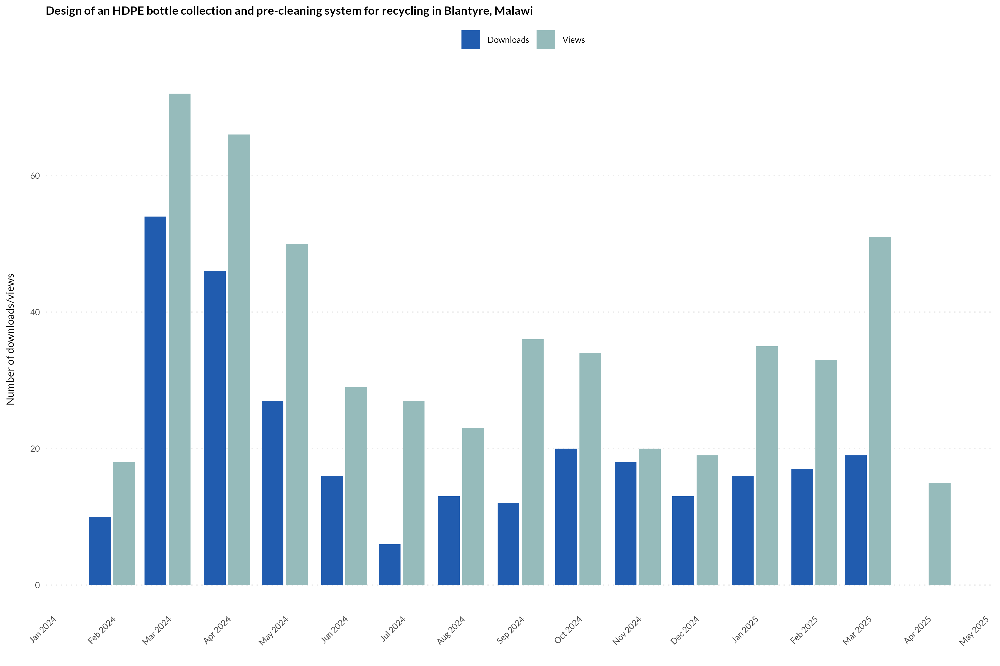
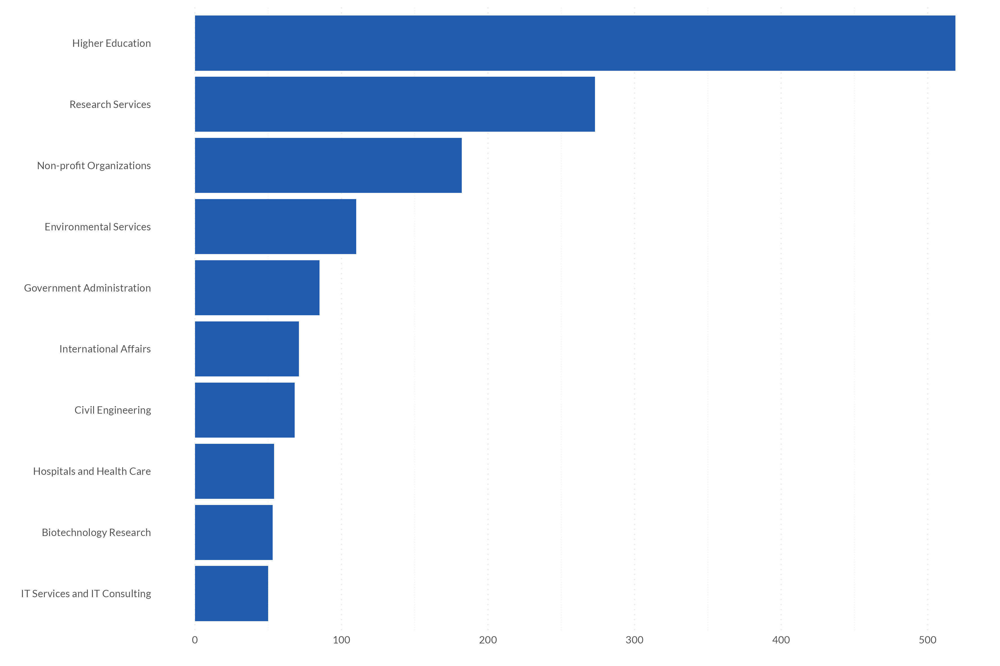

# Beyond Citations: Harnessing Metadata Across Digital Platforms to Measure Research Visibility

<!-- badges: start -->

<!-- badges: end -->

Since Global Health Engineering (GHE) started in 2021, 133 students have written their thesis with us of which 48 are publicly available through [ETH’s Research Collection](https://www.research-collection.ethz.ch/discover?&filtertype_1=split_leitzahl&filter_relational_operator_1=equals&filter_1=09746%20-%20Tilley,%20Elizabeth%20/%20Tilley,%20Elizabeth). On [GitHub](https://github.com/Global-Health-Engineering), we have published 41 repositories, including software, hardware, and datasets – open to everyone. Nearly 3,000 people follow us on [LinkedIn](https://www.linkedin.com/company/global-health-engineering/). Yet, none of these numbers factor into conventional metrics for measuring our research's visibility. Despite long-standing criticism, the quantity of scientific publications and their citations remain the primary measures of research impact (see [here](https://journals.plos.org/plosone/article?id=10.1371/journal.pone.0173152), [here](https://journals.lww.com/ajpmr/abstract/2019/04000/measuring_the_impact_of_research_using.14.aspx), or [here](https://www.uzh.ch/blog/hbz/2019/11/12/alternative-ways-to-measure-research-impact/?lang=en)).

There are alternatives. Arguably most prominently in the form of [Altmetric](https://www.altmetric.com/), which tracks interactions with scientific outputs across a broad range of digital platforms. [PlumX](https://www.elsevier.com/insights/metrics/plumx) does the same. However, these services still work best with articles published in journals. But what about student theses archived in institutional repositories? Hardware designs we've tested and would like to share with a wider audience after prototyping? Datasets on water points or soil conditions we’ve compiled that NGOs and policy-makers could benefit from?

In this blog post, we highlight two platforms, ETH’s Research Collection and LinkedIn, from which we collect data to measure the visibility of research outputs that fall outside traditional journal publications. Think of it as creating your own Altmetrics, all based on data that you can either collect yourself or retrieve through APIs. We make this data available in “[ghedata](https://github.com/Global-Health-Engineering/ghedata)”, an R data package containing the metadata in tidy format from different platforms. This data package follows the principles we apply to our data processing and publishing workflows, with emphasis on sharing data following best practices for [FAIR data sharing principles](https://www.nature.com/articles/sdata201618). By showcasing the data from these platforms and how readily it's collected, we hope to lower the barrier to access these resources, to show potential use cases, and encourage other researchers and groups to join our efforts in redefining research visibility beyond traditional citation metrics.

## The Problem with Traditional Metrics

Accessing academic papers comes with a hefty price tag. For example, to access articles in Nature, one of the world’s most prestigious journals, institutions have to pay 12,396 Euros every year for its members to have access ([Source](https://www.springernature.com/gp/librarians/licensing/journals-catalog/journal-price-lists)). Since researchers need access to a variety of journals, universities usually negotiate "bundles" to access all journals from a publishing house for a lump sum. These agreements aren't disclosed, but are usually in the millions of dollars for large institutions ([Source](https://www.timeshighereducation.com/news/uk-universities-paid-big-publishers-ps1billion-past-decade)). 

As a result, most scientific work hides behind paywalls. Despite widespread agreement that publicly funded research should be openly accessible, the reality is that journal articles remain inaccessible for many. This significantly disadvantages researchers and students at institutions with limited budgets, even more so those in the Global South. For our group, conducting most of its research in over-exploited countries, these paywalls create a critical barrier to reaching our target audience. In other words, we miss those who could benefit the most. Therefore, we need methods and platforms that not only help us make our results as accessible as possible, but also enable us to confirm if we're reaching our intended audience.  

## Coming up with our own Altmetrics

Since 2021, we’ve followed an [open-by-default approach](https://en.wikipedia.org/wiki/Open_by_default) to guarantee equitable access to our research outputs whenever possible. We share our work across various channels: software and hardware designs are on [GitHub](https://github.com/Global-Health-Engineering/), our manuscripts are archived in ETH’s Research Collection, and we share our research activities with a broader audience on [LinkedIn](https://www.linkedin.com/company/global-health-engineering). Over the years, we have gathered a wealth of data, either collected directly or through a platform’s API, that we leverage to measure our research's visibility in other ways. We think this approach can be interesting to other groups seeking alternative solutions, as by now, many maintain active presences on platforms like LinkedIn and GitHub, which collect valuable metadata and usage metrics. Below, we present two of these platforms, ETH’s Reserach Collection and LinkedIn, and show how we use their metadata.

### ETH Research Collection

The [Research Collection](https://www.research-collection.ethz.ch/) is ETH Zurich's repository for publications and research data. Following [ETH’s open-access policy (Source)](https://ethz.ch/en/research/open-science/open-access.html), GHE has been archiving not only its scientific articles on this platform but also publishing most of its student theses. The platform is accessible to everyone and trackers collect a number of insightful metadata about the uploaded research outputs. This includes the type of research output, its license, the number of views, and even the most frequent locations of access to the research output. Accessing this research metadata has become easier thanks to the [newly revised API](https://developer.library.ethz.ch/apis), and both ETH members and external users can request an API key to access the metadata.

For example, we can observe the evolution of our research outputs over time. The graphic below highlights a continuous rise in student theses since 2021\. Furthermore, the group has diversified its outputs to include datasets and "other publications", largely hardware designs, over the years. This data not only helps Professor Tilley underline her thesis supervision responsibilities within the department but also allows us to convey to external stakeholders our contributions by being able to track our research progress.  

The Research Collection also collects metadata on licenses, an essential part of helping users to know how they can use, share, and build on our work. We aim to give users as much freedom as possible by licensing most of our research outputs under CC-BY 4.0, giving them the right to share and adapt our materials, even commercially, as long as we are credited. However, the graphic below shows that we don't always meet our goal. Every year, 5-30% of all research outputs don't have a license.

Lastly, the research collection tracks access data. The graph below visualizes the monthly downloads and views of a master's thesis that was published in February 2024\. Nearly a year and a half later, the thesis still seems to be well-received. On average, the work is downloaded 20 times and viewed 35 times per month. We only have these insights thanks to its publication on the Research Collection. Although it was never formally published, it still seems to find a target audience. In a next phase, once the API is overhauled, we'll need to investigate the origin of the views and downloads to see where readers access it from.

The metadata from the Research Collection primarily helps us track our outputs. We can see how the type of output changes over time and see which products resonate with a wider audience. These insights, in turn, help us set thematic priorities. However, the metadata also serves as a monitoring tool for us. In this case, it highlights that we still have work to do to license them appropriately once they’re published. 

### LinkedIn

LinkedIn is our most important platform for sharing our research with a wider audience. To cultivate team ownership, the responsibility for our Monday posts (covering ongoing projects, published papers, or behind-the-scenes glimpses) rotates among team members. These regular posts are paying off: we now have nearly 3,000 followers.. But where are these followers coming from? Are they mostly academics, or are practitioners also consuming our content? Thanks to the data provided by LinkedIn, we can answer such questions.

Indeed, our followers primarily come from Higher Education and Research Services. Yet, it's encouraging to see NGOs ranking third and followers also from Government Administrations. We’re equally interested in the geographic distribution of our followers. For the group, located in Switzerland with a research focus on Sub-Saharan Africa, the location data provided by LinkedIn is invaluable for ensuring we reach our intended audience not only domestically but also internationally.

This goal is supported by our user demographics: while most of our followers are Swiss, we're especially pleased that four African nations, including Malawi, South Africa, and Kenya where we have ongoing projects, are among our top ten follower countries.

LinkedIn provides a lot more data. We use it to track engagement rates of our posts, most active times of our followers and other metadata to see who interacts the most with our posts. LinkedIn provides an API, but this data can also be easily downloaded as an Excel spreadsheet for those who aren’t experienced using APIs, making the data readily available for analysis. 

## More metrics and looking forward

ETH's Research Collection and LinkedIn are two of many platforms whose data we use to gain insights into the visibility of our research. We haven’t mentioned usage statistics from GitHub, internally collected data on student supervision, or web traffic analyses of our website. This blog post’s goal was to provide an initial glimpse into the wealth of data that can be used from platforms researchers use daily, and whose metadata can serve as reporting resources and monitoring tools.

By publishing all metadata in our "ghedata" package, we want to encourage others to also bundle their data in tidy formats and make it publicly available. This allows to see what data other groups are collecting, how they are analyzing it, and ultimately, to learn from each other. Collecting this data via an API significantly simplifies this process as thanks to its standardized output, little data processing is required to create a dataset that can be used for analysis.

In the near future, we aim to further expand "ghedata" and build a robust pipeline that allows us to collect and archive this data as automatically as possible. We also want to make the data more accessible. Through dashboards or automated reports, we want to not only inform the group's management but also give all members the opportunity to assess the reach and usage statistics of their work.

We are happy to announce that we will present two of these initiatives in more detail at the [Swiss Open Academic Data (SOAD) Day](https://soad.ch/) on September 10th in Zurich. [Lars Schöbitz](https://ghe.ethz.ch/about/people/person-detail.MjkyODc2.TGlzdC80MTI2LC0xNDYwMDMwNTU3.html) will speak about "Publishing Open Metadata for Open Research Data Projects of the ETH Domain," and [Colin Walder](https://ghe.ethz.ch/about/people/person-detail.MjYzMjMy.TGlzdC80MTI2LC0xNDYwMDMwNTU3.html) will discuss "Retrieving and Visualizing Research Metadata with ETH’s Research Collection API." There are still a few open spots\!

